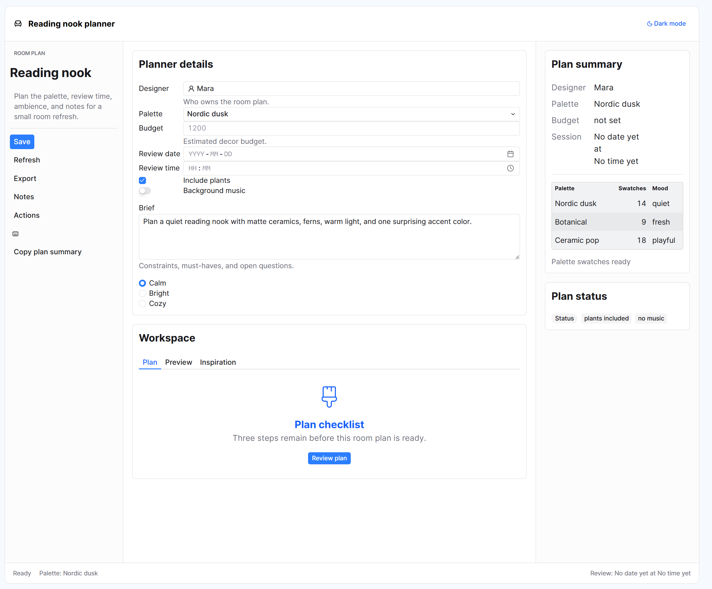

<h1 align="center">
  <picture>
    
  </picture>
   
  Skyline
</h1>

Skyline is Jane Street’s UI component library for [`bonsai_web`](https://github.com/janestreet/bonsai_web), our front-end framework written in OCaml. Skyline components are designed to work well with the compact, data dense user interfaces that our traders and software engineers use every day. The components are also intended to be flexible, so that they can be used across any and all Bonsai web applications at the firm.

  <h3 >
    A demo app using Skyline
  </h3>
  <picture>
    
  </picture>

